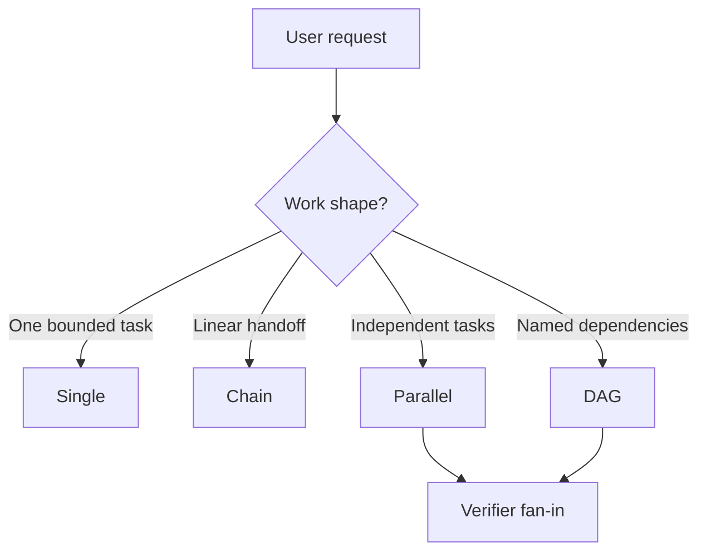

# pi-subflow

Delegate bounded work from Pi to isolated subagents with single-task, chain, parallel, and DAG workflows.

`pi-subflow` is a Pi extension and TypeScript orchestration core for coordinating focused subagents without putting planning, policy checks, execution, validation, and rendering into one oversized prompt.

Use it when work benefits from independent research/review streams, staged handoffs, or a final verifier. Do not use it for small direct tasks the current assistant can do faster by itself.

## Features

- Single, chain, parallel, DAG, bounded-loop, and nested-workflow subagent execution
- DAG preflight validation with precise diagnostics
- `dagYaml` shorthand for concise LLM-authored task graphs
- Inline nested workflows with parent/child namespacing and synthetic summaries
- Verifier fan-in with dependency-output injection
- Markdown-section and minimal JSON required-field validation
- Retry, timeout, max-turn, and budget helpers
- Project/user agent discovery with policy gates
- Runtime tool allowlist checks
- Workflow slash commands from `.pi/subflow/workflows/*.{yaml,yml}` and `~/.pi/agent/subflow/workflows/*.{yaml,yml}`
- JSONL run history at `.pi/subflow/runs.jsonl`

## Quick start

```bash
git clone git@github.com:5queezer/pi-subflow.git pi-subflow
cd pi-subflow
npm install
npm run build
pi -e ./dist/extension.js
```

Then ask Pi to use the `subflow` tool, for example:

```text
Use subflow to run API, test, and docs reviewers in parallel, then run a verifier that synthesizes the findings.
```

For local development, you can symlink the built extension and reload Pi after rebuilding. The build also links `dist/node_modules` back to the project dependencies so Pi can resolve runtime packages such as `yaml` when the extension directory points at `dist`.

```bash
ln -sfn "$PWD/dist" ~/.pi/agent/extensions/subflow
npm run build
# then run /reload inside Pi
```

## Workflow modes



| Mode | Use when | Input shape |
| --- | --- | --- |
| Single | exactly one focused subagent task is useful | `agent` + `task` |
| Chain | each step needs the previous step's output | `chain: [{ agent, task }]` with optional `{previous}` |
| Parallel | 2+ tasks are independent | `tasks: [...]` with no `dependsOn` |
| DAG | tasks have named dependencies, verifier fan-in, or bounded loops | `tasks: [...]` with `dependsOn`, `loop`, or `dagYaml` |
| Nested workflows | a task contains an inline child workflow | `workflow: { tasks: [...] }` or `workflow: { dagYaml }` |

Example DAG shorthand:

```yaml
api-review:
  agent: reviewer
  task: Review src/index.ts and public exports

test-review:
  agent: reviewer
  task: Review tests for coverage gaps

final-verdict:
  agent: reviewer
  role: verifier
  needs: [api-review, test-review]
  task: Synthesize the findings into a prioritized verdict
```

Verifier tasks receive dependency outputs automatically. A verifier with no explicit `dependsOn` depends on all non-verifier tasks. `dagYaml` is parsed as YAML, so arrays can be written inline (`needs: [api-review, test-review]`) or as block sequences. Nested workflows namespace child task names under the parent, flow the parent `dependsOn` into workflow roots, and expose a synthetic parent summary for downstream dependents. Bounded loops repeat a namespaced body up to `loop.maxIterations`, can stop early with `loop.until`, and expose a synthetic loop summary for downstream dependents.

## Workflow templates

Example workflows live in [`examples/workflows/`](examples/workflows/). They advertise the DAG YAML schema with:

```yaml
# yaml-language-server: $schema=https://raw.githubusercontent.com/5queezer/pi-subflow/refs/heads/master/schemas/subflow-dag.schema.json
```

- [`code-review.yaml`](examples/workflows/code-review.yaml)
- [`implementation-planning.yaml`](examples/workflows/implementation-planning.yaml)
- [`research-synthesis.yaml`](examples/workflows/research-synthesis.yaml)
- [`docs-consistency.yaml`](examples/workflows/docs-consistency.yaml)
- [`bug-investigation.yaml`](examples/workflows/bug-investigation.yaml)

Copy a `.yaml` or `.yml` template into `.pi/subflow/workflows/` to register it as a slash command at Pi session startup:

```text
.pi/subflow/workflows/code-review.yaml -> /code-review
.pi/subflow/workflows/code-review.yml  -> /code-review
```

User-level workflow files are also supported under `~/.pi/agent/subflow/workflows/`. If a project and user workflow have the same command name, the project workflow wins. During prompt-resource discovery, the extension writes generated prompt stubs under `.pi/subflow/prompts/` or `~/.pi/agent/subflow/prompts/` when no manual prompt file with the same name exists, so Pi can discover the workflow prompt surface. Run `/reload` or start a new session after adding, removing, or renaming workflow files.

## Development

```bash
npm install
npm run build && npm test
```

Before submitting changes, run:

```bash
npm run build && npm test
```

## Documentation

- [GitHub Wiki](https://github.com/5queezer/pi-subflow/wiki) — detailed usage, TypeScript API, configuration, policy, architecture, roadmap notes for conditional branches, nested workflows, dynamic dependency graphs, self-optimizing static DAGs, and troubleshooting. Source pages live in [`doc/wiki/`](doc/wiki/) and are published with `npm run wiki:sync` or `npm run wiki:sync:push`.
- [`schemas/subflow-dag.schema.json`](schemas/subflow-dag.schema.json) — YAML schema for workflow templates
- [`doc/adr/`](doc/adr/) — architecture decision records
- [`CONTRIBUTING.md`](CONTRIBUTING.md) — contribution workflow

Keep the README, wiki, ADRs, and the `subflow` tool's LLM-facing guidance synchronized when behavior, schema, validation, public API, install/test commands, or design rationale change.

## License

ISC
