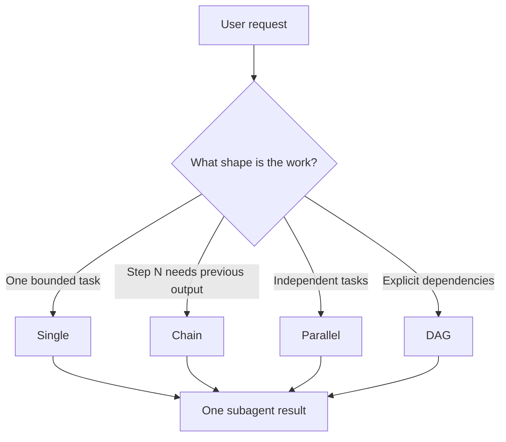
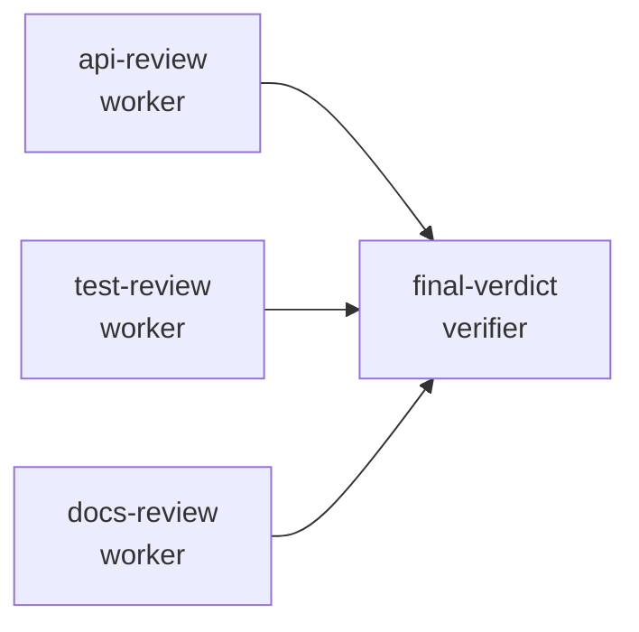
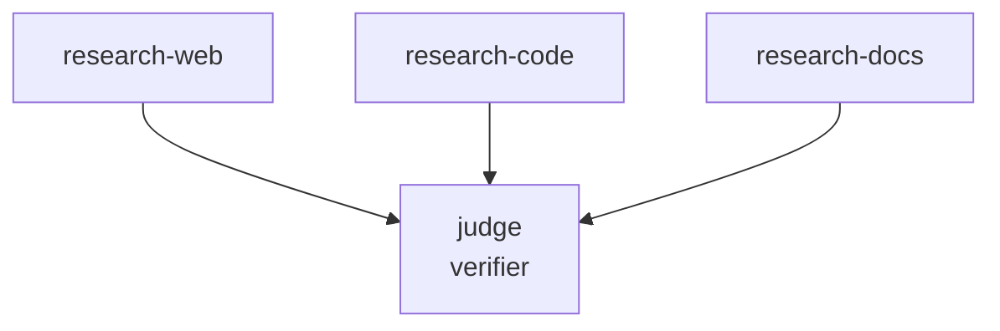
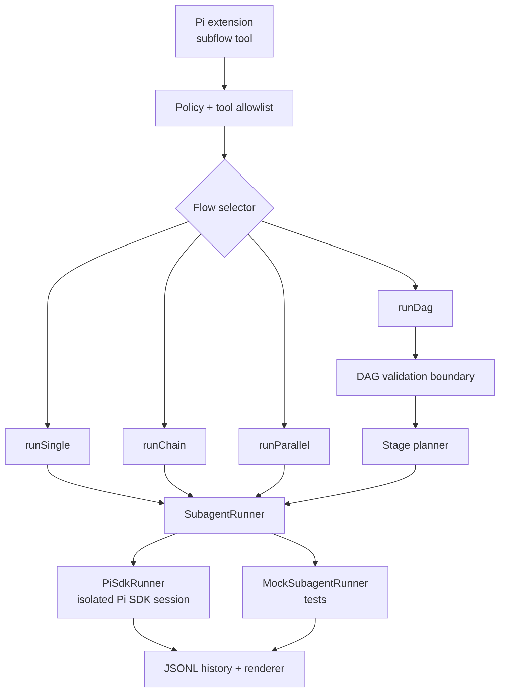

# pi-subflow

Delegate bounded work from Pi to isolated subagents with single-task, chain, parallel, and DAG workflows.

`pi-subflow` is a Pi extension and TypeScript orchestration core for running small teams of subagents without mixing workflow planning, policy checks, execution, validation, and rendering into one giant tool. It is most useful when a task has independent research/review streams, staged handoffs, or a final verifier that should synthesize dependency outputs.

## Why use it?

Use `pi-subflow` when one assistant turn should coordinate multiple focused agents while keeping each agent bounded:

- ask several agents to inspect independent parts of a codebase in parallel
- run a scout → implementer → reviewer chain with explicit handoff text
- fan out research tasks, then fan in to one or more verifier/synthesis nodes
- enforce DAG validation before any subagent starts
- keep Pi-specific execution behind a small `SubagentRunner` boundary

Do **not** use it for small direct tasks the current assistant can do faster by itself.

## Workflow modes



| Mode | Use when | Input shape |
| --- | --- | --- |
| Single | exactly one focused subagent task is useful | `agent` + `task` |
| Chain | a linear pipeline where each step may consume the immediately previous result | `chain: [{ agent, task }]` with optional `{previous}` |
| Parallel | 2+ independent tasks can run concurrently | `tasks: [...]` with no `dependsOn` |
| DAG | named dependencies, parallel stages, and verifier fan-in | `tasks: [...]` with `dependsOn`, or `dagYaml` shorthand |

### Chain vs DAG

A DAG can represent the execution order of a chain by making each task depend on the previous task, but the two modes are intentionally not identical:

- `chain` is an ergonomic linear pipeline. Each step runs after the previous step and can splice the previous step's output into its prompt with `{previous}`.
- `dag` is a named dependency graph. Dependencies control scheduling and failure propagation. Dependency outputs are automatically injected only for `role: "verifier"` tasks, where fan-in synthesis is expected.

Use `chain` for simple scout → implementer → reviewer handoffs where each prompt needs the previous answer. Use `dag` when tasks need explicit names, fan-out/fan-in, parallel dependency stages, verifier synthesis, or graph validation.

## DAGs: the interesting part

DAG mode runs dependency stages in order. Tasks with no dependencies run first; dependent tasks run only after their prerequisites complete. Verifier tasks receive dependency outputs automatically, so synthesis nodes do not need to parse graph structure from task text.



Example DAG:

```json
{
  "tasks": [
    {
      "name": "api-review",
      "agent": "reviewer",
      "task": "Review src/index.ts and public exports",
      "tools": ["read"],
      "model": "openai-codex/gpt-5.4-mini"
    },
    {
      "name": "tests-review",
      "agent": "reviewer",
      "task": "Review tests for missing failure-path coverage",
      "tools": ["read"],
      "model": "openai-codex/gpt-5.4-mini"
    },
    {
      "name": "final-verdict",
      "agent": "reviewer",
      "role": "verifier",
      "dependsOn": ["api-review", "tests-review"],
      "task": "Synthesize the dependency outputs into a prioritized verdict",
      "tools": ["read"],
      "model": "openai-codex/gpt-5.4-mini"
    }
  ]
}
```

For LLM-authored DAGs, the Pi tool also accepts `dagYaml`, a concise dependency-free YAML subset. The YAML root is a mapping from task names to task fields, and `needs` is normalized to `dependsOn`. Use either `needs` or `dependsOn` on a task, not both:

```yaml
api-review:
  agent: reviewer
  task: Review src/index.ts and public exports
  tools: [read]
  model: openai-codex/gpt-5.4-mini

tests-review:
  agent: reviewer
  task: Review tests for missing failure-path coverage
  tools: [read]
  model: openai-codex/gpt-5.4-mini

final-verdict:
  agent: reviewer
  role: verifier
  needs: [api-review, tests-review]
  task: Synthesize the dependency outputs into a prioritized verdict
```

The shorthand is only an authoring format at the Pi tool boundary; internally it becomes the same `tasks` array shown above. It intentionally supports a small LLM-friendly subset: task mappings, scalar strings, inline string arrays such as `[read, bash]`, one nested `jsonSchema.required` mapping, and `|`/`>` block strings. YAML anchors, aliases, and advanced tags are not supported.

DAG validation happens before execution. Invalid graphs fail before any subagent runs:

| Invalid DAG | Error |
| --- | --- |
| duplicate task name | `duplicate DAG task name: dup` |
| missing dependency | `task verify depends on missing task missing` |
| self-dependency | `task loop cannot depend on itself` |
| dependency cycle | `dependency cycle: a -> b -> a` |

Verifier fan-in shortcut: if a task has `role: "verifier"` and no explicit `dependsOn`, it depends on all non-verifier tasks.



## Features

- Single, chain, parallel, and DAG execution
- DAG preflight validation with precise diagnostics
- YAML DAG shorthand for concise LLM-authored task graphs
- Deterministic stage planning for dependency graphs
- Structured `dependsOn` metadata on `SubagentResult`
- Verifier dependency-output injection
- Markdown section and minimal JSON required-field validation
- Verifier repair and re-verification rounds
- Retry, timeout, and aggregate budget helpers
- Retry safety: mutating and external-side-effect tasks are not retried
- Pi SDK runner with isolated in-memory Pi sessions per subagent run
- Agent markdown discovery from user and project scopes
- Agent-defined `tools`, `model`, and `thinking` defaults
- Runtime tool allowlist checks
- Project-agent and external-side-effect policy gates
- JSONL run history at `.pi/subflow-runs.jsonl`
- Live progress widget with running/completed/failed/skipped counts
- LLM-facing `promptSnippet` and `promptGuidelines` so Pi knows when and how to use the loaded tool

## Installation

### From pi.dev / npm

After the package is published, install it as a Pi package:

```bash
pi install npm:pi-subflow
```

For one-off testing without adding it to settings:

```bash
pi -e npm:pi-subflow
```

### Local development install

Clone the repository, install dependencies, build, then load the built extension:

```bash
git clone <repo-url> pi-subflow
cd pi-subflow
npm install
npm run build
pi -e ./dist/extension.js
```

During local development, you can also symlink the built extension into Pi's global extension directory:

```bash
ln -sfn "$PWD/dist" ~/.pi/agent/extensions/subflow
```

Run `/reload` in Pi after rebuilding.

## Usage in Pi

Once loaded, Pi gets a `subflow` tool. Ask Pi for bounded multi-agent work, for example:

```text
Use subflow to run three read-only code review agents in parallel:
1. API surface review
2. test coverage review
3. README/docs review
Then run a verifier that synthesizes the findings.
Use cheap models for the first three tasks and a stronger model for the verifier.
```

For explicit DAGs, `dagYaml` is the most compact authoring form:

```yaml
api-review:
  agent: reviewer
  task: Review src/index.ts and public exports

test-review:
  agent: reviewer
  task: Review tests for coverage gaps

final-verdict:
  agent: reviewer
  role: verifier
  needs: [api-review, test-review]
  task: Synthesize the findings into a prioritized verdict
```

The extension records JSONL history to `.pi/subflow-runs.jsonl` in the active project. An interactive history browser is planned, but is not registered until its TUI behavior is stable.

## Workflow templates

Copy/paste templates from `examples/workflows/` into the `dagYaml` parameter, then adjust agent names, target paths, and task text for your project. The templates are plain YAML examples; they do not add built-in named workflows or slash commands.

| Template | Use when | Path |
| --- | --- | --- |
| Code review fan-in | independent API, tests, and docs reviewers should feed one verdict | [`examples/workflows/code-review.yaml`](examples/workflows/code-review.yaml) |
| Implementation planning | requirements, architecture, and risk scouts should feed one implementation plan | [`examples/workflows/implementation-planning.yaml`](examples/workflows/implementation-planning.yaml) |
| Research synthesis | web, repository, and docs research should be reconciled into one answer | [`examples/workflows/research-synthesis.yaml`](examples/workflows/research-synthesis.yaml) |
| Docs consistency | README, ADR, and LLM-facing guidance should be checked together | [`examples/workflows/docs-consistency.yaml`](examples/workflows/docs-consistency.yaml) |
| Bug investigation | repro, code-path, and test-gap scouts should feed one root-cause analysis | [`examples/workflows/bug-investigation.yaml`](examples/workflows/bug-investigation.yaml) |

These examples intentionally use generic agent names such as `reviewer`, `planner`, `researcher`, and `debugger`. Rename them to match agents installed in your Pi user or project agent directories.

## TypeScript API

`pi-subflow` can also be used as a library.

```ts
import { MockSubagentRunner, runDag } from "pi-subflow";

const runner = new MockSubagentRunner({
  scout: async ({ task }) => `found: ${task}`,
  reviewer: async ({ task }) => `verified:\n${task}`,
});

const result = await runDag(
  {
    tasks: [
      { name: "frontend", agent: "scout", task: "Inspect frontend auth" },
      { name: "backend", agent: "scout", task: "Inspect backend auth" },
      {
        name: "verify",
        agent: "reviewer",
        role: "verifier",
        dependsOn: ["frontend", "backend"],
        task: "Synthesize findings",
      },
    ],
  },
  { runner },
);

console.log(result.status, result.output);
```

Primary exports:

- `runSingle`, `runChain`, `runParallel`, `runDag`
- `validateDagTasks`, `planDagStages`
- `discoverAgents`
- `validateExecutionPolicy`
- `appendRunHistory`
- `MockSubagentRunner`, `PiSdkRunner`
- `registerPiSubflowExtension`, `piSubflowExtension`

## Configuration and policy

### Agent scope

Agents are markdown files discovered from user and/or project directories. Project-local agents require confirmation in interactive sessions unless explicitly disabled.

```json
{
  "agentScope": "both",
  "confirmProjectAgents": true
}
```

### Tools

Set the minimum tool subset each subagent needs:

```json
{
  "tools": ["read", "grep", "find"]
}
```

By default, explicit task tools are checked against this runtime allowlist:

```text
read, bash, grep, find, ls, edit, write
```

Embedders can override the allowlist through `registerPiSubflowExtension(..., { allowedTools })`.

### Models and thinking

Set `model` and `thinking` globally, per task, or in agent frontmatter. Explicit task values win over agent defaults.

```json
{
  "model": "openai-codex/gpt-5.4-mini",
  "thinking": "low"
}
```

### Risk and retries

External side-effect tasks require high risk tolerance and confirmation or explicit bypass. Mutating and external-side-effect tasks are not retried, even when `maxRetries` is greater than 1.

```json
{
  "riskTolerance": "high",
  "maxRetries": 2,
  "timeoutSeconds": 120,
  "maxTurns": 40
}
```

## Architecture



Important boundaries:

- Workflow functions are independent from Pi UI concerns.
- `SubagentRunner` isolates orchestration from real Pi execution.
- `PiSdkRunner` creates a fresh in-memory Pi SDK session per subagent run.
- Agent markdown is included as quoted untrusted context, below system and caller instructions.
- DAG normalization, validation, and planning live behind the DAG validation boundary.

## Development

```bash
npm install
npm run build
npm test
```

Before claiming a change is complete, run:

```bash
npm run build && npm test
```

Husky installs from the `prepare` script and runs the same build-plus-test check in `.husky/pre-commit` before commits.

The test suite covers orchestration behavior, DAG validation, policy checks, Pi extension rendering, JSONL run history recording, SDK runner behavior, and LLM-facing prompt guidance.

## Troubleshooting

### Pi still shows old DAG validation errors

If invalid DAGs return a generic error such as:

```text
dependency cycle or unknown dependency among: ...
```

Pi may be loading an older extension implementation. Check for conflicts:

```bash
ls -la ~/.pi/agent/extensions
readlink -f ~/.pi/agent/extensions/subflow
```

The local development symlink should point to:

```text
/home/christian/Projects/pi-subflow/dist
```

Rebuild and reload:

```bash
npm run build
# then run /reload inside Pi
```

### Invalid role errors

Only these task roles are valid:

```text
worker, verifier
```

Omit `role` for normal worker tasks. Do not use invented roles such as `researcher`.

### Verifier did not receive dependency outputs

Dependency outputs are injected for verifier tasks. Set:

```json
{ "role": "verifier" }
```

on synthesis, judge, or validation nodes that need dependency context.

## Roadmap

The current DAG validation boundary is intentionally small and dependency-free. Before adding conditional branches, nested workflows, dynamic dependency graphs, or graph visualization, the project should re-evaluate a graph library such as `graphlib` and treat validation as a workflow IR boundary.

## Architecture decision records

ADRs live in [`docs/adr/`](docs/adr/):

- [`ADR 0001: Use PocketFlow for the subagent orchestration core`](docs/adr/0001-pocketflow-orchestration-core.md)
- [`ADR 0002: Introduce a DAG validation boundary before advanced workflow features`](docs/adr/0002-dag-validation-ir-boundary.md)

Keep this README, ADRs, and the `subflow` tool's LLM-facing `promptSnippet` / `promptGuidelines` synchronized when behavior, schema, validation, public API, install/test commands, or design rationale change.

## License

ISC
