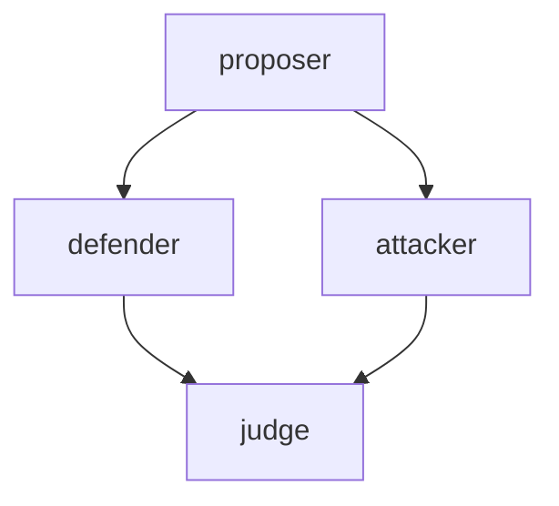
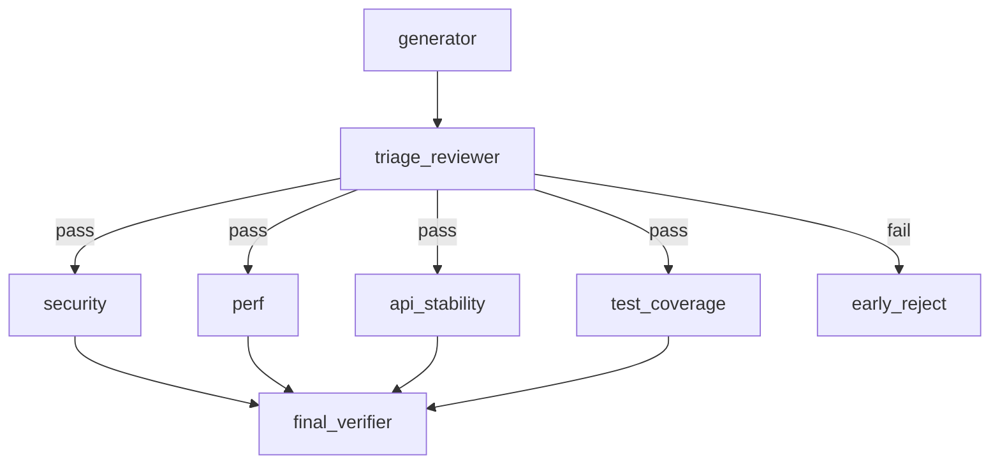
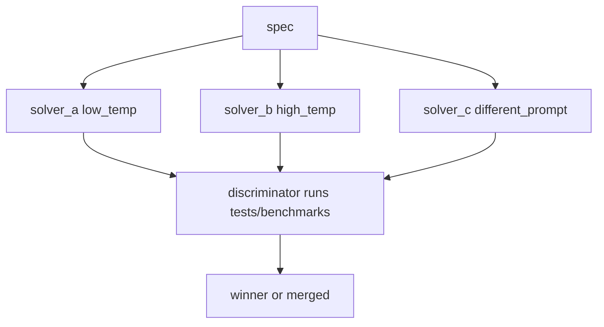
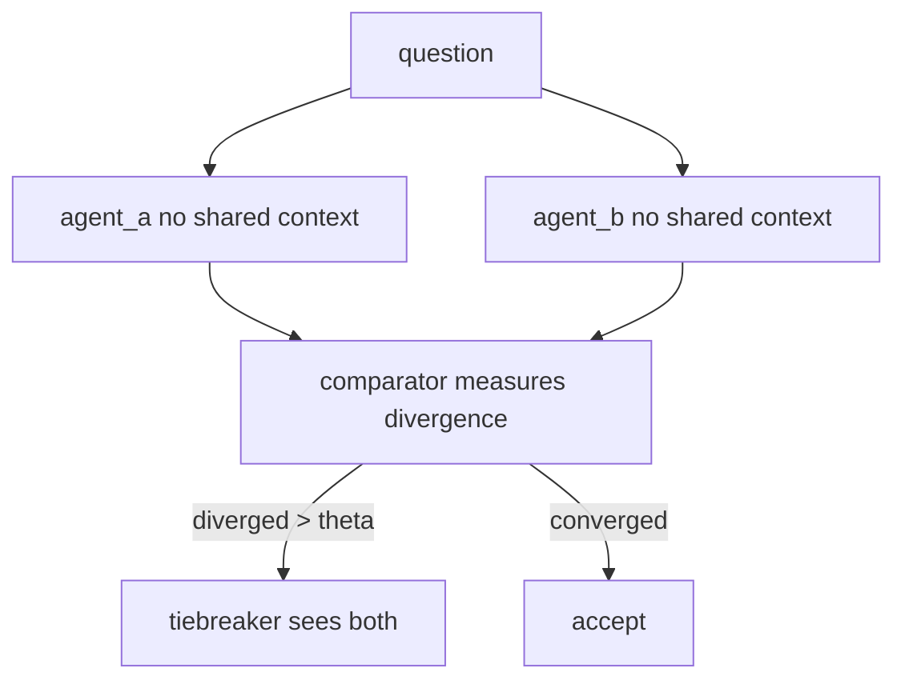
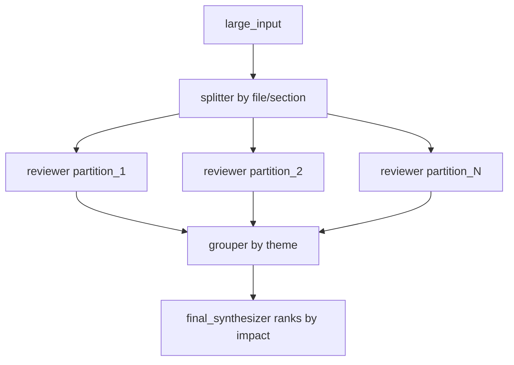

# DAGs

DAG mode runs dependency stages in order. Tasks with no dependencies run first; dependent tasks run only after prerequisites complete. Verifier tasks receive dependency outputs automatically.

Example task array:

```json
{
  "tasks": [
    {
      "name": "api-review",
      "agent": "reviewer",
      "task": "Review src/index.ts and public exports",
      "tools": ["read"],
      "model": "openai-codex/gpt-5.4-mini"
    },
    {
      "name": "tests-review",
      "agent": "reviewer",
      "task": "Review tests for missing failure-path coverage",
      "tools": ["read"],
      "model": "openai-codex/gpt-5.4-mini"
    },
    {
      "name": "final-verdict",
      "agent": "reviewer",
      "role": "verifier",
      "dependsOn": ["api-review", "tests-review"],
      "task": "Synthesize dependency outputs into a prioritized verdict",
      "tools": ["read"],
      "model": "openai-codex/gpt-5.4-mini"
    }
  ]
}
```

### `dagYaml` shorthand

For LLM-authored DAGs, the Pi tool accepts `dagYaml`. The YAML root is a mapping from task names to task fields. `needs` is an authoring alias normalized to `dependsOn` before DAG validation; use one or the other, not both.

```yaml
api-review:
  agent: reviewer
  task: Review src/index.ts and public exports
  tools: [read]
  model: openai-codex/gpt-5.4-mini

tests-review:
  agent: reviewer
  task: Review tests for missing failure-path coverage
  tools: [read]
  model: openai-codex/gpt-5.4-mini

final-verdict:
  agent: reviewer
  role: verifier
  needs: [api-review, tests-review]
  task: Synthesize dependency outputs into a prioritized verdict
```

The shorthand is only an authoring format at the Pi tool boundary. Internally it becomes the same `tasks` array.

### Supported task fields

| Field | Type / values | Notes |
| --- | --- | --- |
| `name` | string | Optional in arrays; implicit from each `dagYaml` top-level key. |
| `agent` | string | Required unless the task is a nested `workflow` or `loop` parent. |
| `task` | string | Required unless the task is a nested `workflow` or `loop` parent. |
| `when` | string | Safe conditional expression such as `${score.output.value} > 0.7`; references must point to dependencies. |
| `workflow` | nested workflow | Inline child workflow; child task names are namespaced under the parent. |
| `loop` | bounded repeated sub-DAG | Repeated body with `maxIterations`, `body`, and optional `until`. |
| `cwd` | string | Optional working directory; workflow slash commands reject absolute paths and `..`. |
| `dependsOn` / `needs` | string[] | DAG dependencies; `needs` is a `dagYaml` alias and cannot be combined with `dependsOn`. |
| `role` | `worker` \| `verifier` | Omit for normal workers; verifier tasks receive dependency outputs. |
| `authority` | `read_only` \| `internal_mutation` \| `external_side_effect` | Drives retry and policy behavior. |
| `tools` | string[] | Minimum tool subset for the subagent. |
| `model` | string | Model identifier passed through the Pi model registry by the SDK runner. |
| `thinking` | `off` \| `minimal` \| `low` \| `medium` \| `high` \| `xhigh` | Can be set globally, per task, or in agent frontmatter. |
| `expectedSections` | string[] | Markdown headings that must appear in successful task output. |
| `jsonSchema.required` | string[] | Minimal JSON-output validation only: task output must parse as JSON and named top-level required fields must be present. |

### Conditional edges

Use `when` to guard a task on dependency output. The expression is evaluated safely against completed dependency results.

```yaml
publish:
  agent: reviewer
  dependsOn: [score]
  when: "${score.output.score} > 0.7"
  task: Publish only if the score is high enough
```

If the expression is false, the task is skipped. If the expression is invalid or references a non-dependency, validation fails.

### Nested workflows

A DAG task can contain an inline nested workflow with `workflow.tasks` or `workflow.dagYaml`. Child task names are namespaced under the parent task (for example, `review.api`), parent `dependsOn` values flow into workflow roots, and the parent task exposes a synthetic summary result for downstream dependents. `workflow.uses` is accepted by the schema but is currently reserved and has no runtime effect.

### Bounded loops

A DAG task can repeat a body with `loop: { maxIterations, body, until? }`. The loop parent may omit `agent` and `task`, just like workflow parents. Body tasks are namespaced per iteration (`research-loop.1.editor`), root body tasks inherit the loop parent's dependencies on the first pass, later passes inherit the previous iteration's terminal nodes, and `until` evaluates against current-iteration aliases such as `${editor.output.continue} == false`. `maxIterations` is capped at 100. The loop parent emits a synthetic summary with the iteration count and final status.

### Validation

Validation happens before execution. Invalid graphs fail before any subagent runs.

| Invalid DAG | Error |
| --- | --- |
| duplicate task name | `duplicate DAG task name: dup` |
| missing dependency | `task verify depends on missing task missing` |
| self-dependency | `task loop cannot depend on itself` |
| dependency cycle | `dependency cycle: a -> b -> a` |
| invalid when expression | `task review has invalid when expression: ...` |
| invalid loop maxIterations | `task research-loop loop maxIterations must be a positive integer` |

Verifier fan-in shortcut: if a task has `role: "verifier"` and no explicit `dependsOn`, it depends on all non-verifier tasks.

## Workflow Patterns Beyond Parallel Fan-Out

Five DAG patterns that go beyond the standard "fan-out then verifier" shape, with concrete triggers and the gaps in pure-DAG semantics they expose.

### 1. Adversarial Triangle (debate, not parallel polling)



Defender MUST steelman the proposal, attacker MUST find blockers. Structurally different from parallel perspectives because each side sees the proposer's brief (chained, not isolated), forcing real engagement instead of orthogonal opinions.

**Use:** code review where groupthink is suspected, evaluating an architectural proposal you already lean toward, RFC review.
**Shape:** chains (proposer to defender, proposer to attacker) with DAG fan-in to judge.

### 2. Two-Tier Audit (cheap gate before expensive fan-out)



Triage is fast and cheap. Failed triage skips the parallel audits. Saves tokens on PRs that are obviously not ready.

**Use:** PR review pipelines, refactor proposals, multi-stage release gates.
**Pure-DAG limitation:** conditional edges. Today you run all audits and let the verifier short-circuit, paying full fan-out cost.

### 3. Tournament (n-best with deterministic discriminator)



Three solvers, deliberately different priors (temperature, prompt framing, model). Discriminator is **deterministic** (test pass count, benchmark numbers, lint score), not another LLM judge.

**Use:** algorithmic problems with verifiable output, codegen with a test suite, prompt optimization. Skip for subjective work, ranking becomes noise.

### 4. Cross-Validation (blind redundancy for irreversible decisions)



Same task, two independent runs without shared context. Catches the failure mode where one agent hallucinates a confident recommendation. Expensive, so reserve for high-stakes outputs.

**Use:** decisions with no take-back (production migrations, schema changes, policy decisions), audits where a single point of failure is unacceptable.

### 5. Map-Group-Reduce (partition by structure)



Generalization of the standard "review N files in parallel" pattern. The intermediate **grouper** node re-organizes outputs by theme (security, perf, UX) instead of by partition (file_1, file_2), so the final synthesizer ranks across the whole input rather than per partition.

**Use:** large codebase audits, multi-document research synthesis, log analysis, content review across many pages.

## What pure DAG cannot express

Three roadmap items, ranked by how often they actually constrain real workflows:

1. **Conditional edges** (boolean predicate on task output). Patterns 2 and 4 both need this. Highest frequency. Without it, every downstream branch runs even when the gate would have rejected.
2. **Nested workflows** (a task IS a sub-DAG). Required to compose `code-review.yaml` inside `implementation-planning.yaml`. Without it, workflows duplicate or inline.
3. **Bounded loops** (researcher to writer to editor to "more research?" back to researcher). Pure DAG forbids cycles. Workaround: unroll to fixed depth (`researcher_v1 to writer_v1 to editor to researcher_v2`). Ugly but bounded, and arguably safer than uncapped recursion.

Conditional edges before nested workflows. The frequency gap is large.

**Proposed schema addition for conditional edges:**

```yaml
deploy:
  agent: deployer
  task: Push to production
  needs: [audit]
  when: "${audit.output.score} > 0.7"
```

Predicate is a JSONPath-style expression over upstream task outputs, evaluated at edge-traversal time. If false, the task and its descendants are skipped (and a `skipped` status propagates so the verifier knows what was pruned versus failed).

## Go further

- [[Workflow templates and slash commands|Workflow-templates-and-slash-commands]]
- Explore the pattern templates in `examples/workflows/`:
  - [adversarial-triangle.yaml](https://github.com/5queezer/pi-subflow/blob/main/examples/workflows/adversarial-triangle.yaml)
  - [two-tier-audit.yaml](https://github.com/5queezer/pi-subflow/blob/main/examples/workflows/two-tier-audit.yaml)
  - [tournament.yaml](https://github.com/5queezer/pi-subflow/blob/main/examples/workflows/tournament.yaml)
  - [cross-validation.yaml](https://github.com/5queezer/pi-subflow/blob/main/examples/workflows/cross-validation.yaml)
  - [map-group-reduce.yaml](https://github.com/5queezer/pi-subflow/blob/main/examples/workflows/map-group-reduce.yaml)

### Web links

- General DAG: https://en.wikipedia.org/wiki/Directed_acyclic_graph
- Conditional routing in state graphs (LangGraph): https://reference.langchain.com/python/langgraph/graph/state/StateGraph/add_conditional_edges
- MapReduce overview and the original paper:
  - https://hadoop.apache.org/docs/stable/hadoop-mapreduce-client/hadoop-mapreduce-client-core/MapReduceTutorial.html
  - https://research.google.com/archive/mapreduce-osdi04.pdf
- Multi-agent structured debate / adjudication patterns:
  - https://arxiv.org/html/2604.26506v1
  - https://arxiv.org/html/2604.09153v1
- Independent adjudication and divergence checks:
  - https://pmc.ncbi.nlm.nih.gov/articles/PMC5465459/
- Verifying with deterministic scoring and benchmarks:
  - https://www.v7labs.com/blog/ensemble-learning-guide
  - https://www.confident-ai.com/blog/llm-evaluation-metrics-everything-you-need-for-llm-evaluation
- Roadmap priorities (conditional edges first): [[Roadmap]].
