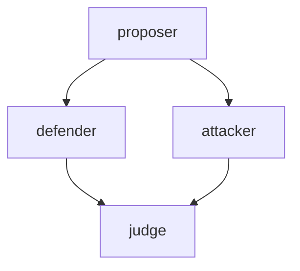
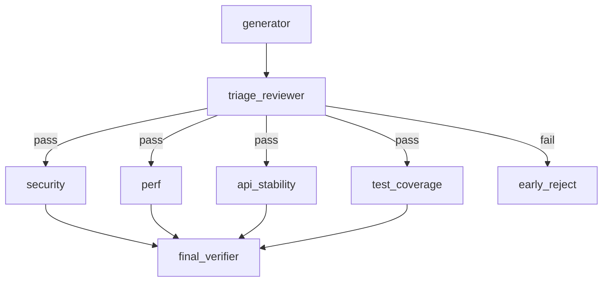
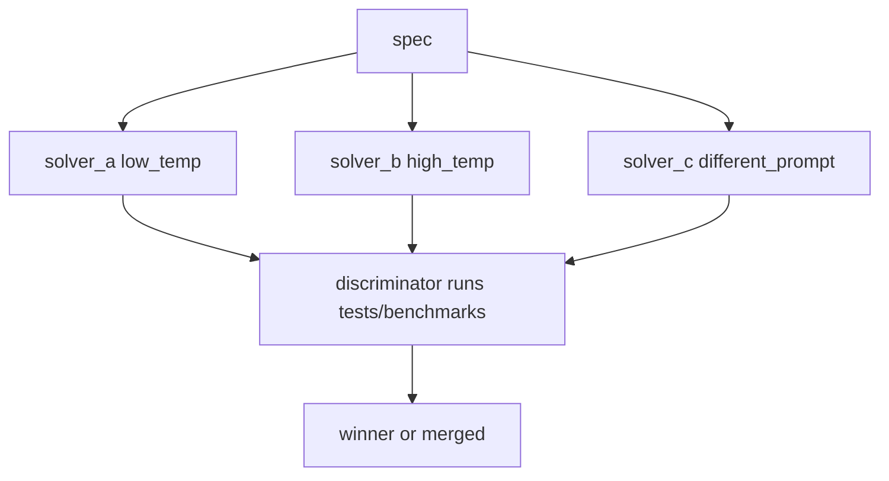
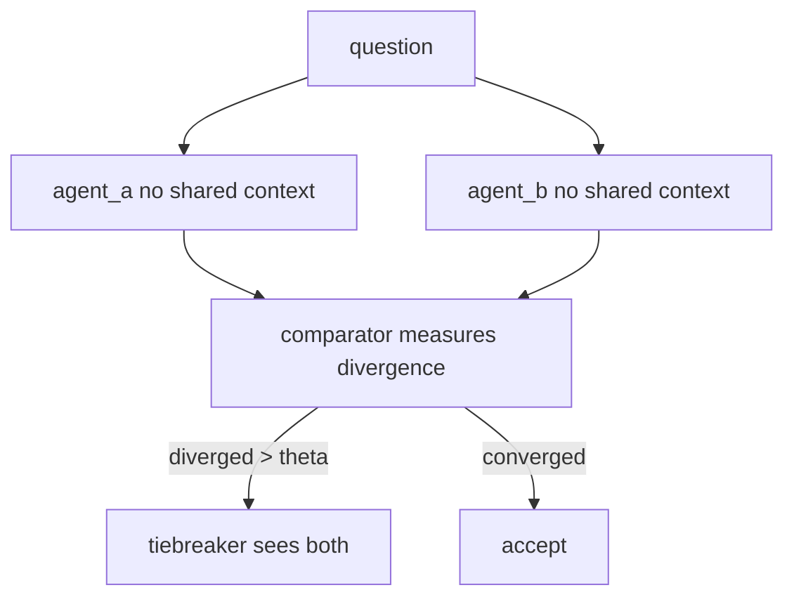
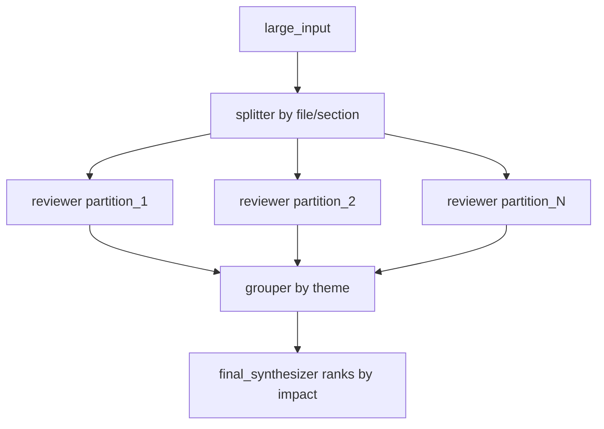

# Workflow patterns

Five DAG patterns that go beyond the standard "fan-out then verifier" shape, with concrete triggers and the gaps in pure-DAG semantics they expose.

See [[DAGs|DAGs]] for schema, validation, and execution semantics.

## Model tiers used below

Tiers are abstract — map them to whatever your stack offers. The Codex IDs below come from the model card in `~/.pi/agent/AGENTS.md`.

| Tier   | Codex ID(s)                                  | Cap | Speed | Notes                                                                                                                                                                          |
| ------ | -------------------------------------------- | :-: | :---: | ------------------------------------------------------------------------------------------------------------------------------------------------------------------------------ |
| Spark  | `gpt-5.3-codex-spark`                        |  3  |   5   | Near-instant. Needs detailed instructions. Rate-limited — burns quota *because* it's fast (many turns per minute). Use at gates and mechanical splits, not inside fan-outs.    |
| Mini   | `gpt-5.4-mini`                               |  3  |   4   | Cheap, capable enough for parallel fan-out workhorses.                                                                                                                          |
| Strong | `gpt-5.5` (general) / `gpt-5.3-codex` (code) |  5  |   3   | Frontier reasoning. Use for verdicts, irreversible decisions, and roles that must produce novel arguments rather than apply a tight spec.                                       |

Wall-clock notes per pattern are critical-path latency, not per-call.

## 1. Adversarial Triangle (debate, not parallel polling)



Defender MUST steelman the proposal, attacker MUST find blockers. Structurally different from parallel perspectives because each side sees the proposer's brief (chained, not isolated), forcing real engagement instead of orthogonal opinions.

**Use:** code review where groupthink is suspected, evaluating an architectural proposal you already lean toward, RFC review.
**Shape:** chains (proposer to defender, proposer to attacker) with DAG fan-in to judge.

**Model fit:**

| agent    | tier   | why                                                |
| -------- | ------ | -------------------------------------------------- |
| proposer | Strong | sets the substantive frame; weak frame poisons all |
| defender | Strong | must steelman, not parrot                          |
| attacker | Strong | finds non-obvious blockers, not surface nits       |
| judge    | Strong | weighs both sides; verdict quality matters         |

Wall-clock: slow — three Strong-tier hops on the critical path. Spark fit: poor; every role is novel reasoning, not spec-following.

## 2. Two-Tier Audit (cheap gate before expensive fan-out)



Triage is fast and cheap. Failed triage skips the parallel audits. Saves tokens on PRs that are obviously not ready.

**Use:** PR review pipelines, refactor proposals, multi-stage release gates.
**Pure-DAG limitation:** conditional edges. Today you run all audits and let the verifier short-circuit, paying full fan-out cost.

**Model fit:**

| agent             | tier   | why                                                       |
| ----------------- | ------ | --------------------------------------------------------- |
| generator         | Strong | code/proposal quality bounds everything downstream        |
| triage_reviewer   | Spark  | textbook gate role: tight spec, fast verdict, cheap fail  |
| security          | Strong | subtle issues; low recall here is the worst failure mode  |
| perf              | Mini   | mostly heuristic checks against known anti-patterns       |
| api_stability     | Mini   | structural diff against the published surface             |
| test_coverage     | Mini   | coverage analysis is mechanical                           |
| final_verifier    | Strong | synthesizes parallel signals into a single verdict        |
| early_reject      | Spark  | emits a templated rejection                               |

Wall-clock: moderate — Spark gate, then parallel Mini audits, then one Strong synth. Spark fit: ideal at the gate; *avoid* inside the fan-out (parallel Spark calls drain quota fast).

## 3. Tournament (n-best with deterministic discriminator)



Three solvers, deliberately different priors (temperature, prompt framing, model). Discriminator is **deterministic** (test pass count, benchmark numbers, lint score), not another LLM judge.

**Use:** algorithmic problems with verifiable output, codegen with a test suite, prompt optimization. Skip for subjective work, ranking becomes noise.

**Model fit:**

| agent          | tier                            | why                                                    |
| -------------- | ------------------------------- | ------------------------------------------------------ |
| solver_a       | Strong (`gpt-5.3-codex`, low T) | coding-specialist deterministic baseline               |
| solver_b       | Strong (`gpt-5.5`, high T)      | general frontier with exploration                      |
| solver_c       | Spark (`gpt-5.3-codex-spark`)   | the "different prior" — fastest, tightest spec         |
| discriminator  | none (deterministic)            | runs tests/benchmarks; if forced LLM, Mini             |

Wall-clock: bound by the slowest solver (Strong). Spark fit: excellent — tournaments *want* tier diversity, and Spark's "needs detailed instructions" constraint gives it a naturally distinct prior from Strong's freer reasoning.

## 4. Cross-Validation (blind redundancy for irreversible decisions)



Same task, two independent runs without shared context. Catches the failure mode where one agent hallucinates a confident recommendation. Expensive, so reserve for high-stakes outputs.

**Use:** decisions with no take-back (production migrations, schema changes, policy decisions), audits where a single point of failure is unacceptable.

**Model fit:**

| agent      | tier                     | why                                                            |
| ---------- | ------------------------ | -------------------------------------------------------------- |
| agent_a    | Strong (`gpt-5.5`)       | high-stakes output; quality dominates cost                     |
| agent_b    | Strong (`gpt-5.3-codex`) | different model family for genuine independence                |
| comparator | Mini                     | structural divergence check; cheap and frequent                |
| tiebreaker | Strong (`gpt-5.5`)       | sees both, must reason about the disagreement itself           |

Wall-clock: slow — two parallel Strong runs plus an optional Strong tiebreaker. Spark fit: poor; a fast, weakly-grounded run is exactly the failure mode this pattern guards against.

## 5. Map-Group-Reduce (partition by structure)



Generalization of the standard "review N files in parallel" pattern. The intermediate **grouper** node re-organizes outputs by theme (security, perf, UX) instead of by partition (file_1, file_2), so the final synthesizer ranks across the whole input rather than per partition.

**Use:** large codebase audits, multi-document research synthesis, log analysis, content review across many pages.

**Model fit:**

| agent             | tier             | why                                                       |
| ----------------- | ---------------- | --------------------------------------------------------- |
| splitter          | Spark            | mechanical partition by file/section; tight spec          |
| reviewer × N      | Mini             | parallel workhorse; volume drives cost                    |
| grouper           | Mini or Strong   | Mini if themes are predefined; Strong if inferring themes |
| final_synthesizer | Strong           | ranks across the whole input; impact judgment             |

Wall-clock: bound by the reviewers (parallel) plus the final synth. Spark fit: ideal for the splitter; for reviewers, only if N is small *and* instructions are tight — otherwise Spark's quota drains mid-fan-out.

## Beyond pure DAG

The DAG path already supports the three features that pure-DAG semantics cannot express. See [[DAGs]] for full schema and validation rules.

1. **Conditional edges** — `when:` on a task is a safe expression over upstream outputs (e.g. `${triage.output.score} > 0.7`). When false, the task and its descendants are marked `skipped` so the verifier can distinguish pruned from failed. Referenced tasks must be dependencies; this is enforced at validation time.
2. **Nested workflows** — a task can carry a `workflow:` with inline `tasks`, inline `dagYaml`, or a static relative include via `uses`. Child task names are namespaced under the parent (e.g. `review.api`), parent `dependsOn` values flow into workflow roots, and the parent exposes a synthetic summary result for downstream dependents.
3. **Bounded loops** — `loop: { maxIterations, body, until }` repeats a namespaced subgraph with an early-stop expression. `maxIterations` is capped by `MAX_LOOP_ITERATIONS` so cycles stay bounded.

Example — gate audits on a cheap triage:

```yaml
deploy:
  agent: deployer
  task: Push to production
  needs: [audit]
  when: "${audit.output.score} > 0.7"
```

Remaining graph-roadmap items (dynamic dependencies, richer diagnostics, visualization) are tracked in [[Roadmap]].

## Go further

- [[Workflow templates and slash commands|Workflow-templates-and-slash-commands]]
- Explore the pattern templates in `examples/workflows/patterns/`:
  - [adversarial-triangle.yaml](https://github.com/5queezer/pi-subflow/blob/main/examples/workflows/patterns/adversarial-triangle.yaml)
  - [two-tier-audit.yaml](https://github.com/5queezer/pi-subflow/blob/main/examples/workflows/patterns/two-tier-audit.yaml)
  - [tournament.yaml](https://github.com/5queezer/pi-subflow/blob/main/examples/workflows/patterns/tournament.yaml)
  - [cross-validation.yaml](https://github.com/5queezer/pi-subflow/blob/main/examples/workflows/patterns/cross-validation.yaml)
  - [map-group-reduce.yaml](https://github.com/5queezer/pi-subflow/blob/main/examples/workflows/patterns/map-group-reduce.yaml)

### Web links

- General DAG: https://en.wikipedia.org/wiki/Directed_acyclic_graph
- Conditional routing in state graphs (LangGraph): https://reference.langchain.com/python/langgraph/graph/state/StateGraph/add_conditional_edges
- MapReduce overview and the original paper:
  - https://hadoop.apache.org/docs/stable/hadoop-mapreduce-client/hadoop-mapreduce-client-core/MapReduceTutorial.html
  - https://research.google.com/archive/mapreduce-osdi04.pdf
- Multi-agent structured debate / adjudication patterns:
  - https://arxiv.org/html/2604.26506v1
  - https://arxiv.org/html/2604.09153v1
- Independent adjudication and divergence checks:
  - https://pmc.ncbi.nlm.nih.gov/articles/PMC5465459/
- Verifying with deterministic scoring and benchmarks:
  - https://www.v7labs.com/blog/ensemble-learning-guide
  - https://www.confident-ai.com/blog/llm-evaluation-metrics-everything-you-need-for-llm-evaluation
- Roadmap priorities (conditional edges first): [[Roadmap]].
