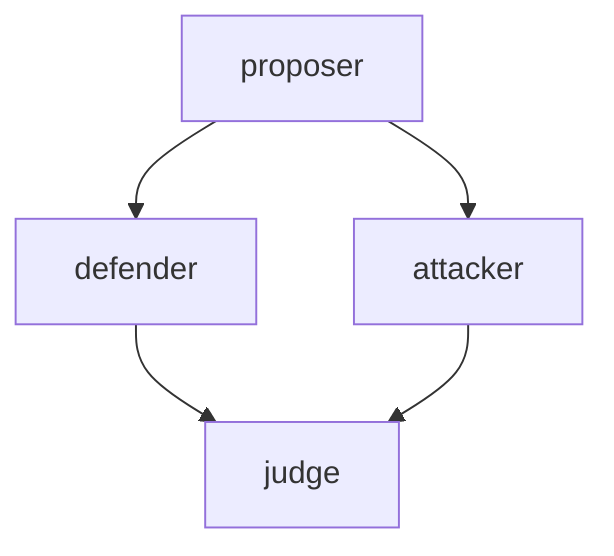
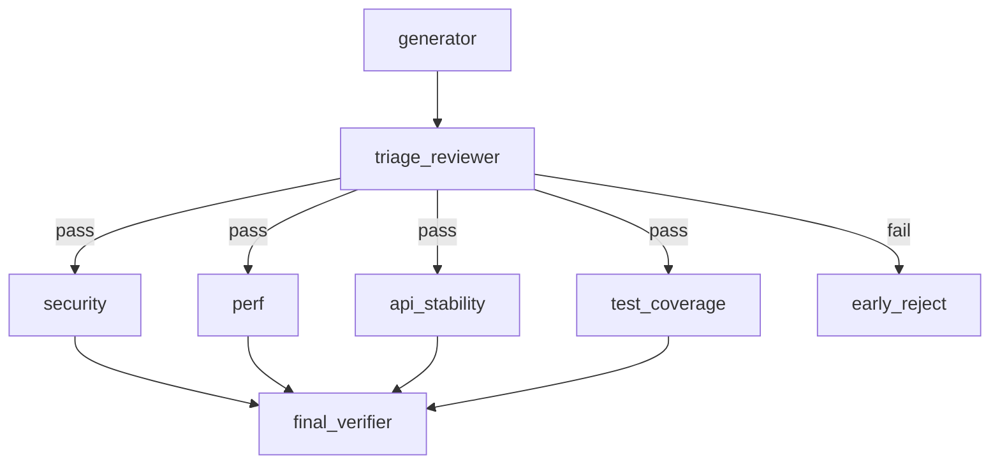
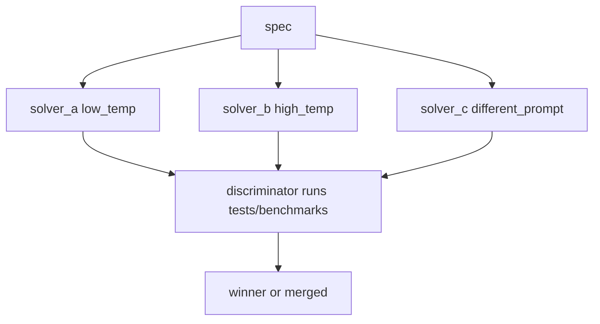
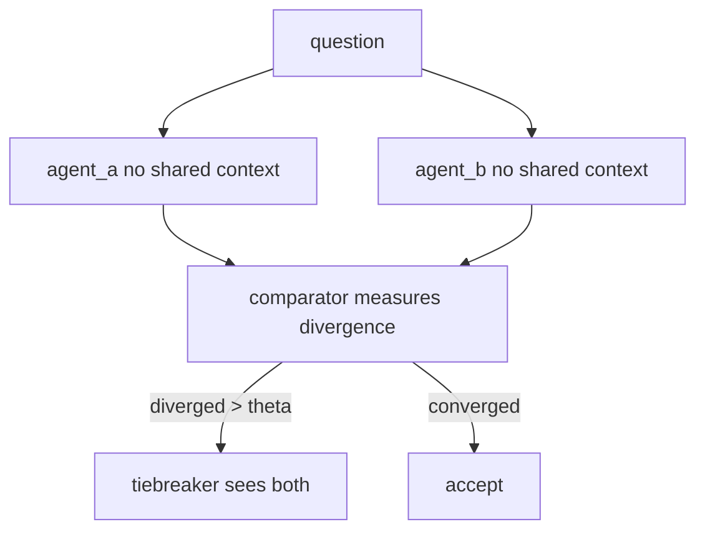
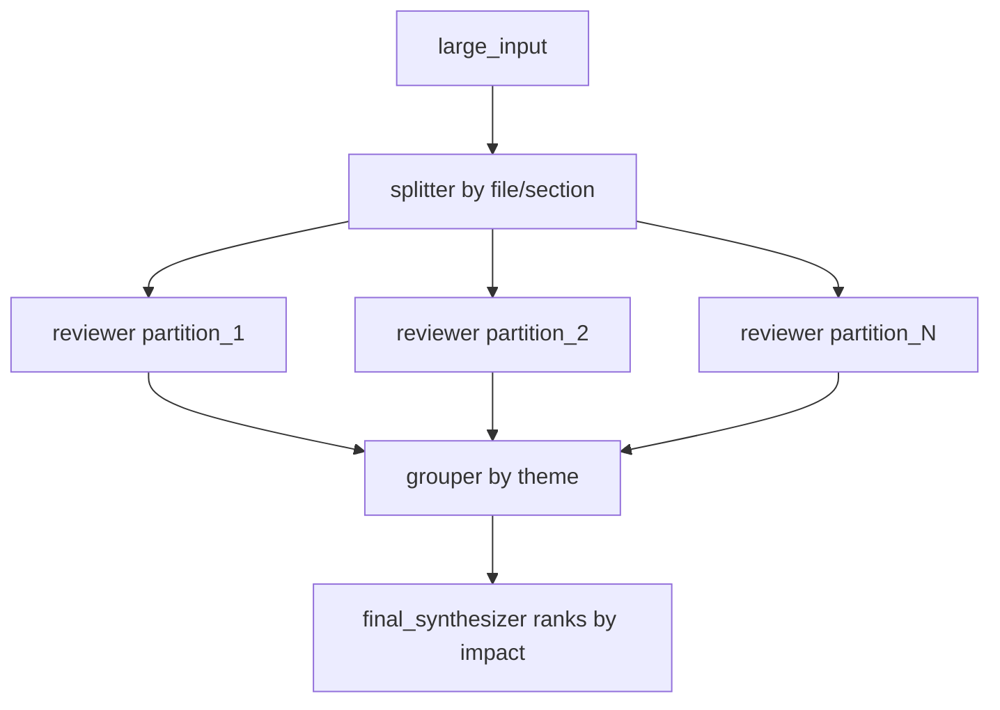

# Workflow patterns

Five DAG patterns that go beyond the standard "fan-out then verifier" shape, with concrete triggers and the gaps in pure-DAG semantics they expose.

See [[DAGs|DAGs]] for schema, validation, and execution semantics.

## 1. Adversarial Triangle (debate, not parallel polling)



Defender MUST steelman the proposal, attacker MUST find blockers. Structurally different from parallel perspectives because each side sees the proposer's brief (chained, not isolated), forcing real engagement instead of orthogonal opinions.

**Use:** code review where groupthink is suspected, evaluating an architectural proposal you already lean toward, RFC review.
**Shape:** chains (proposer to defender, proposer to attacker) with DAG fan-in to judge.

## 2. Two-Tier Audit (cheap gate before expensive fan-out)



Triage is fast and cheap. Failed triage skips the parallel audits. Saves tokens on PRs that are obviously not ready.

**Use:** PR review pipelines, refactor proposals, multi-stage release gates.
**Pure-DAG limitation:** conditional edges. Today you run all audits and let the verifier short-circuit, paying full fan-out cost.

## 3. Tournament (n-best with deterministic discriminator)



Three solvers, deliberately different priors (temperature, prompt framing, model). Discriminator is **deterministic** (test pass count, benchmark numbers, lint score), not another LLM judge.

**Use:** algorithmic problems with verifiable output, codegen with a test suite, prompt optimization. Skip for subjective work, ranking becomes noise.

## 4. Cross-Validation (blind redundancy for irreversible decisions)



Same task, two independent runs without shared context. Catches the failure mode where one agent hallucinates a confident recommendation. Expensive, so reserve for high-stakes outputs.

**Use:** decisions with no take-back (production migrations, schema changes, policy decisions), audits where a single point of failure is unacceptable.

## 5. Map-Group-Reduce (partition by structure)



Generalization of the standard "review N files in parallel" pattern. The intermediate **grouper** node re-organizes outputs by theme (security, perf, UX) instead of by partition (file_1, file_2), so the final synthesizer ranks across the whole input rather than per partition.

**Use:** large codebase audits, multi-document research synthesis, log analysis, content review across many pages.

## What pure DAG cannot express

Three roadmap items, ranked by how often they actually constrain real workflows:

1. **Conditional edges** (boolean predicate on task output). Patterns 2 and 4 both need this. Highest frequency. Without it, every downstream branch runs even when the gate would have rejected.
2. **Nested workflows** (a task IS a sub-DAG). Required to compose `code-review.yaml` inside `implementation-planning.yaml`. Without it, workflows duplicate or inline.
3. **Bounded loops** (researcher to writer to editor to "more research?" back to researcher). Pure DAG forbids cycles. Workaround: unroll to fixed depth (`researcher_v1 to writer_v1 to editor to researcher_v2`). Ugly but bounded, and arguably safer than uncapped recursion.

Conditional edges before nested workflows. The frequency gap is large.

**Proposed schema addition for conditional edges:**

```yaml
deploy:
  agent: deployer
  task: Push to production
  needs: [audit]
  when: "${audit.output.score} > 0.7"
```

Predicate is a JSONPath-style expression over upstream task outputs, evaluated at edge-traversal time. If false, the task and its descendants are skipped (and a `skipped` status propagates so the verifier knows what was pruned versus failed).

## Go further

- [[Workflow templates and slash commands|Workflow-templates-and-slash-commands]]
- Explore the pattern templates in `examples/workflows/`:
  - [adversarial-triangle.yaml](https://github.com/5queezer/pi-subflow/blob/main/examples/workflows/adversarial-triangle.yaml)
  - [two-tier-audit.yaml](https://github.com/5queezer/pi-subflow/blob/main/examples/workflows/two-tier-audit.yaml)
  - [tournament.yaml](https://github.com/5queezer/pi-subflow/blob/main/examples/workflows/tournament.yaml)
  - [cross-validation.yaml](https://github.com/5queezer/pi-subflow/blob/main/examples/workflows/cross-validation.yaml)
  - [map-group-reduce.yaml](https://github.com/5queezer/pi-subflow/blob/main/examples/workflows/map-group-reduce.yaml)

### Web links

- General DAG: https://en.wikipedia.org/wiki/Directed_acyclic_graph
- Conditional routing in state graphs (LangGraph): https://reference.langchain.com/python/langgraph/graph/state/StateGraph/add_conditional_edges
- MapReduce overview and the original paper:
  - https://hadoop.apache.org/docs/stable/hadoop-mapreduce-client/hadoop-mapreduce-client-core/MapReduceTutorial.html
  - https://research.google.com/archive/mapreduce-osdi04.pdf
- Multi-agent structured debate / adjudication patterns:
  - https://arxiv.org/html/2604.26506v1
  - https://arxiv.org/html/2604.09153v1
- Independent adjudication and divergence checks:
  - https://pmc.ncbi.nlm.nih.gov/articles/PMC5465459/
- Verifying with deterministic scoring and benchmarks:
  - https://www.v7labs.com/blog/ensemble-learning-guide
  - https://www.confident-ai.com/blog/llm-evaluation-metrics-everything-you-need-for-llm-evaluation
- Roadmap priorities (conditional edges first): [[Roadmap]].
